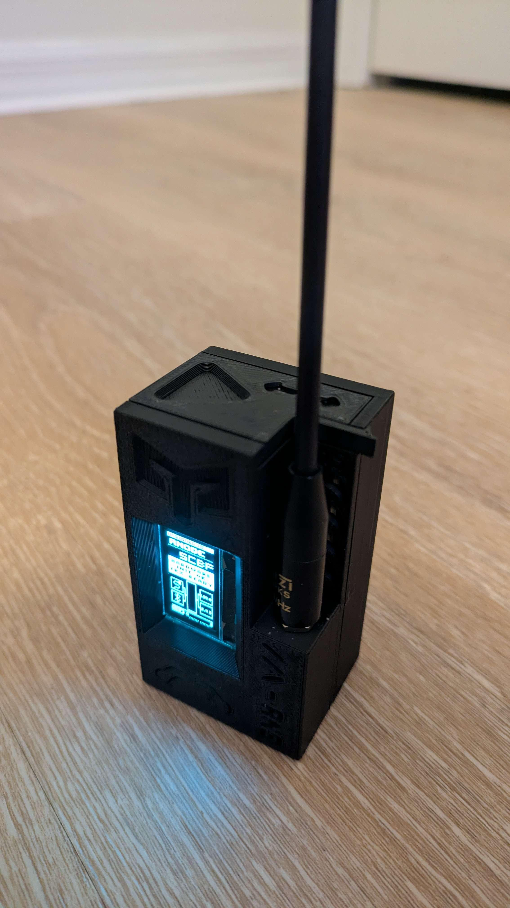
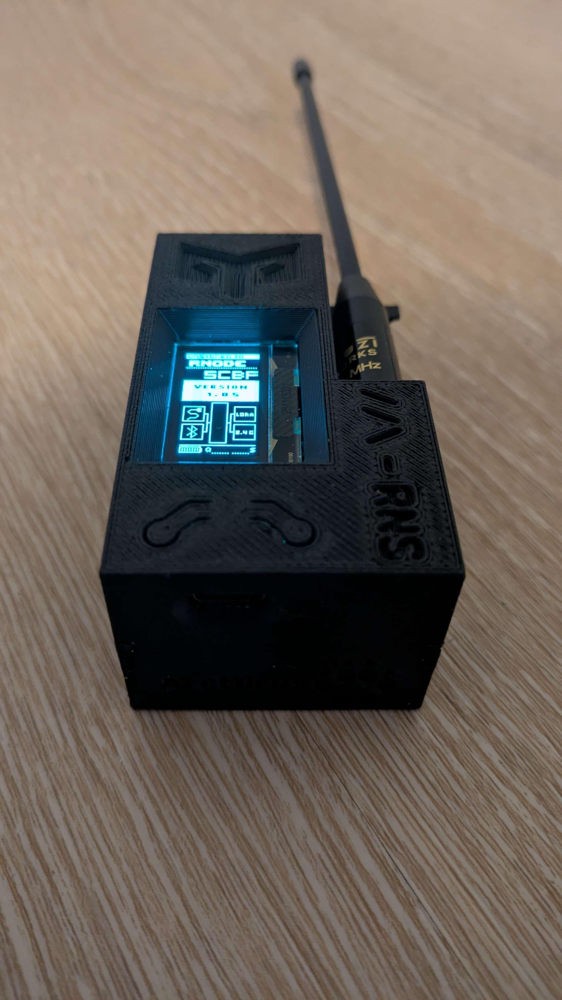
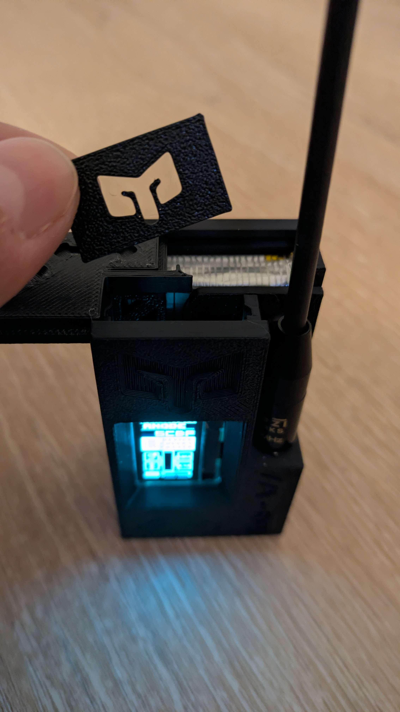

[] [] []
 
 This model was designed with the capabilities of the Flashforge Adventure 5M FDM printer in mind. Printers with similar capabilities will hopefully not experience print issues when it comes to some of the dimensions. The case is meant to be pressed together without glue. However, since the case is not meant to be taken back apart after assembly -- glue may be used for a more secure fit. Access to the board, battery, and antenna (1) remain post assembly.

This model was also designed around the following parts:
- Board: Heltec WiFi LoRa 32 (V3)
- Battery: 3000mAh 3.7V LiPo battery
- Antenna: 915MHz SMA antenna

The file “antenna_template_v2.stl” is meant to be used for the construction of a ground plane. The provided template is meant to construct a ground plane for antennas tuned to 915Mhz. Example images for this are provided in the “antenna_template_reference_images” folder of this directory.

General Recommendations:
- After the ground plane is cut and put in, the antenna can be installed while easier access is still available.
- When assembling, try snapping the sectioning plate (sectioning_plate_v2.stl) onto the board section (board_section_v2.stl) slowly, being careful not to damage the pegs sticking out of the board section. Try installing the sectioning plate in a similar manner you would a car tire, alternating between distant points. The same methodology is recommended when attaching the battery section (battery_section*_v2.stl [2]).
- Paint supports in slicer software for the antenna and the USB-C connection cutout.

Print Settings Used (OrcaSlicer -- Flashforge Adventure 5M):
- Default settings for PLA (0.20mm Standard @Flashforge AD5M 0.4 Nozzle)
- Strength:
-- sparse infill density: 8%
-- sparse infill pattern: Triangles
- Support:
-- enable support: true
-- type: Tree (Manual)
-- on build plate only: true

1. Due to how tightly the parts are packed together, access to the antenna assembly is restricted to through the screen cutout visible in “board_section_v2.stl”. This means that access will be limited yet still possible. The antenna can be installed more easily during assembly of the case, after the ground plane is cut and put in.

2. For "battery_section*_v2.stl" — the asterisk denotes a name variant.

---

This model is provided as-is, and its suitability for the safety and protection of the parts within is without guarantee. The creator and/or distributors of this model are to be held harmless from any damage, destruction, injury, legal liability, or any other unforeseen consequences resulting from the use of this model and any associated materials or information, either directly or indirectly. This includes all content provided alongside the STL files by the original creator, such as print settings, assembly instructions, and any other provided information. Use this model at your own risk.

---

This model is licensed under CC BY-NC 4.0. See license.txt for details.
